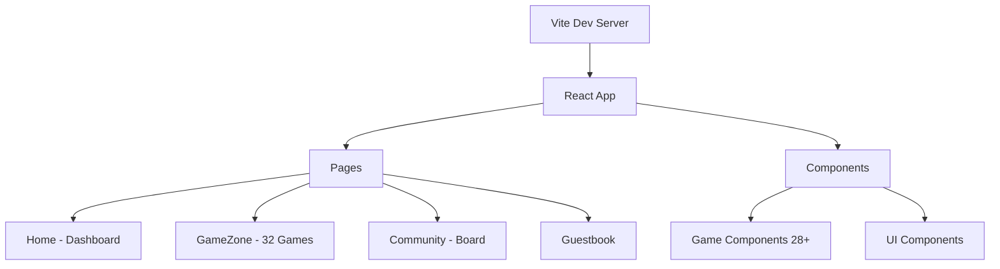

<div align="center">
  

  # 🏠 My Smart Homepage (sia.kr)

  <p>
    <strong>아름답고 강력한 나만의 웹 대시보드 & 커뮤니티 & 게임존</strong>
    <br />
    생산성 도구, 실시간 정보, 그리고 43종의 게임으로 하루를 활기차게 시작하세요.
  </p>

  <p>
    <a href="#-주요-기능">주요 기능</a> •
    <a href="#️-기술-스택">기술 스택</a> •
    <a href="#-시작하기">시작하기</a> •
    <a href="#-게임존-32종">게임존</a> •
    <a href="#-프로젝트-구조">프로젝트 구조</a>
  </p>

  [](https://vitejs.dev/)
  [](https://reactjs.org/)
  [](https://www.typescriptlang.org/)
  [](https://tailwindcss.com/)
  
  [](#-게임존-43종)
  [](#)
</div>

<br />

---

## 📋 프로젝트 소개

**My Smart Homepage**는 브라우저 시작 페이지를 대체할 수 있는 **올인원(All-in-One) 웹 플랫폼**입니다. 

- 🖥️ **스마트 대시보드**: 생산성 도구와 실시간 정보 위젯
- 💬 **커뮤니티 & 방명록**: 소통과 공유의 공간
- 🎮 **43종 게임존**: 클래식 아케이드부터 전략 보드게임까지

모든 기능은 **Glassmorphism** 디자인과 **반응형 레이아웃**으로 구현되어, 데스크탑부터 모바일까지 완벽하게 지원합니다.

> 📦 **Serverless Mode**: 백엔드 설정 없이 `localStorage`를 활용하여 즉시 사용 가능

---

## ✨ 주요 기능

### 🖥️ 스마트 대시보드 (Home)

| 카테고리 | 기능 |
|---------|------|
| **실시간 정보** | 🕒 디지털 시계, 🌤️ 날씨 (서울/부산), 💰 암호화폐 시세 (BTC/ETH), 📈 KOSPI/환율 |
| **생산성 도구** | ✅ 할 일 목록 (드래그 정렬), 🍅 포모도로 타이머, 📝 퀵 메모 |
| **유틸리티** | 🧮 계산기, 🔡 글자수 세기, 🛡️ 비밀번호 생성기, 💻 시스템 정보, 🔧 JSON 포맷터 |

### 💬 커뮤니티 & 소셜

- **커뮤니티 게시판**: 자유롭게 글을 쓰고 공유
- **방명록**: 방문 흔적을 남기고 소통
- *데이터는 개인 정보 보호와 속도를 위해 브라우저 `localStorage`에 저장*

### 🎨 UI/UX 디자인

- **글래스모피즘 (Glassmorphism)**: 반투명 카드와 블러 효과
- **다크/라이트 모드**: 시간 기반 자동 전환 지원
- **반응형 레이아웃**: 모든 디바이스 완벽 지원
- **스무스 애니메이션**: 부드러운 호버 효과와 전환

---

## 🎮 게임존 (43종)

**GameZone**에서 다양한 장르의 **43가지 게임**을 즐길 수 있습니다!

### 🃏 카드 & 보드 게임

| 게임 | 설명 | 주요 기능 |
|------|------|----------|
| ♟️ **체스** | AI 대전 체스 | Stockfish 엔진, 난이도 조절, 수 취소 |
| 🎴 **고스톱** | 한국 전통 화투 게임 | 클래식/이모지 모드, AI 대전, 족보 계산 |
| 🃏 **포커** | 5 Card Draw 포커 | AI 대전, 베팅 시스템 |
| 🃏 **블랙잭** | 21을 향한 카드 게임 | 히트/스탠드/더블다운 |
| 🃏 **솔리테어** | Klondike 솔리테어 | 52장 카드, 클릭 이동 |
| 🃏 **프리셀** | 모든 카드가 보이는 전략 게임 | 4개 프리셀, 8개 캐스케이드 |
| ⚫ **바둑** | AI와 고대 전략 대결 | 9x9/13x13/19x19, 개선된 AI |
| ⭕ **오목** | 5개를 먼저 완성하라 | AI 대전 |
| 🔴 **체커** | 점프로 상대를 잡아라 | King 승격, AI 대전 |
| ❌ **틱택토** | 3x3 삼목 게임 | AI 대전 |
| ⚫ **오셀로** | 돌을 뒤집어 영역 차지 | AI 대전, 코너 전략 |
| 🔴 **커넥트4** | 4개를 연속으로 연결 | AI 대전, 승리/차단 전략 |
| 🚢 **배틀쉽** | 적 함대를 격침시켜라 | 배 배치, AI 대전 |
| 🎲 **요트** | Yahtzee 주사위 게임 | 12라운드, 점수 카테고리 |
| 🀱 **도미노** | AI와 숫자 매칭 대결 | 7개 시작, 체인 매칭 |
| ♟️ **장기** | 한국 전통 장기 | 모든 기물 이동 규칙 |
| 🀄 **마작 솔리테어** | 같은 타일 매칭 제거 | 3층 피라미드, 힌트 |
| ⚔️ **카드 전쟁** | 높은 카드로 상대를 이겨라 | WAR 전쟁 규칙 |
| ⚡ **스피드 카드** | 빠르게 카드 매칭 | AI 대전, 실시간 |
| 🔴 **사이먼** | 패턴을 기억하고 따라하세요 | 사운드, 점수 기록 |
| 🔍 **단어 찾기** | 숨겨진 단어를 드래그 | 한국어 단어, 5개 찾기 |

### 🕹️ 아케이드 게임

| 게임 | 설명 | 주요 기능 |
|------|------|----------|
| 🐍 **스네이크** | 뱀을 키우는 클래식 게임 | Canvas 렌더링, 속도 증가 |
| 👾 **팩맨** | 고전 아케이드 | AI 유령, 스코어 시스템 |
| 🧱 **브레이크아웃** | 벽돌 깨기 게임 | 물리 엔진, 레벨 시스템 |
| 🏓 **핑퐁** | 탁구 게임 | AI 대전, 속도 조절 |
| 🐦 **플래피버드** | 파이프 사이로 비행 | Canvas 애니메이션 |
| 👾 **스페이스 인베이더** | 우주 슈팅 게임 | 적 패턴, 점수 시스템 |
| 🦖 **점프 다이노** | 장애물 점프 게임 | 크롬 공룡 게임 스타일 |
| 🎱 **당구** | 2D 당구 시뮬레이션 | 물리 엔진, 포켓 판정 |
| 🎯 **다트** | 과녁 맞추기 | 파워 게이지, 501 게임 |

### 🧩 퍼즐 & 두뇌 게임

| 게임 | 설명 | 주요 기능 |
|------|------|----------|
| 🔢 **테트리스** | 블록 맞추기 클래식 | 레벨 시스템, 점수 계산 |
| 🎲 **2048** | 숫자 합치기 퍼즐 | 스와이프 조작, 최고점수 |
| 💣 **지뢰찾기** | 폭탄을 피해라 | 3가지 난이도 |
| 🔢 **스도쿠** | 9x9 숫자 퍼즐 | 힌트 기능, 검증 |
| 🃏 **카드 뒤집기** | 메모리 매칭 게임 | 타이머, 이동 횟수 |
| 📝 **단어 퍼즐** | 단어 찾기 게임 | 한국어 지원 |
| 🔤 **행맨** | 단어 맞추기 게임 | 애니메이션 |
| 🔢 **슬라이딩 퍼즐** | 숫자 타일 정렬 | 3x3/4x4/5x5 난이도 |
| 🧊 **루빅스 큐브** | 3D 큐브 퍼즐 | Three.js 3D 렌더링, 모바일 지원, 키보드/버튼 조작 |

### 📚 교육 & 기술 게임

| 게임 | 설명 | 주요 기능 |
|------|------|----------|
| ⚡ **반응속도** | 클릭 반응 테스트 | 밀리초 측정, 최고 기록 |
| ⌨️ **타자연습** | 한국어 타이핑 테스트 | WPM/정확도 측정 |
| ❓ **퀴즈** | 상식 문제 도전 | 카테고리별 문제 |
| 🧮 **암산** | 60초 수학 챌린지 | 시간 제한, 레벨 |

---

## 🛠️ 기술 스택

### Core Technologies

| 기술 | 버전 | 용도 |
|------|------|------|
| ⚛️ **React** | 19.2 | UI 라이브러리 |
| 📘 **TypeScript** | 5.8 | 정적 타입 시스템 |
| ⚡ **Vite** | 6.2 | 빌드 도구 & 개발 서버 |
| 🎨 **Tailwind CSS** | 3.x | 유틸리티 기반 CSS 프레임워크 |

### Dependencies

| 라이브러리 | 버전 | 용도 |
|-----------|------|------|
| 🧭 **React Router DOM** | 7.11 | SPA 라우팅 |
| 🎨 **Lucide React** | 0.475 | 아이콘 라이브러리 |
| 🔄 **@dnd-kit** | 6.3 | 드래그 & 드롭 (Todo 정렬) |
| ♟️ **chess.js** | 1.4 | 체스 로직 엔진 |
| 🤖 **stockfish.js** | 10.0 | 체스 AI 엔진 |
| 🧊 **three** | 0.165 | 3D 렌더링 (루빅스 큐브) |

### Architecture



---

## 🚀 시작하기

### 필수 사항

- **Node.js** v18 이상
- **npm** 또는 **yarn**

### 설치 및 실행

```bash
# 1. 저장소 클론
git clone https://github.com/koreadeveloper/myhomepage.git
cd myhomepage

# 2. 패키지 설치
npm install

# 3. 개발 서버 실행
npm run dev

# 4. 브라우저에서 확인
# http://localhost:5173
```

### 빌드 및 배포

```bash
# 프로덕션 빌드
npm run build

# 빌드 결과 미리보기
npm run preview
```

---

## 📂 프로젝트 구조

```bash
myhomepage/
├── 📄 App.tsx              # 메인 앱 레이아웃 & 라우팅
├── 📄 index.tsx            # 진입점 (Entry point)
├── 📄 types.ts             # TypeScript 타입 정의
│
├── 📁 pages/               # 페이지 컴포넌트
│   ├── Home.tsx            # 스마트 대시보드 (61KB)
│   ├── GameZone.tsx        # 게임존 - 32종 게임 (109KB)
│   ├── Community.tsx       # 커뮤니티 게시판
│   └── Guestbook.tsx       # 방명록
│
├── 📁 components/          # 재사용 가능한 컴포넌트 (28개)
│   ├── 🎮 Games (26개)
│   │   ├── ChessGame.tsx       # 체스 (Stockfish AI)
│   │   ├── GoStopGame.tsx      # 고스톱 (한국 화투)
│   │   ├── PokerGame.tsx       # 포커
│   │   ├── PoolGame.tsx        # 당구 (물리 엔진)
│   │   ├── GoGame.tsx          # 바둑
│   │   ├── RubiksCubeGame.tsx  # 루빅스 큐브
│   │   ├── DartsGame.tsx       # 다트
│   │   ├── CheckersGame.tsx    # 체커
│   │   ├── SolitaireGame.tsx   # 솔리테어
│   │   ├── FreecellGame.tsx    # 프리셀
│   │   └── ... (16+ more games)
│   │
│   └── 🧩 UI Components
│       ├── Modal.tsx           # 모달 컴포넌트
│       ├── Navbar.tsx          # 네비게이션
│       └── MobileControls.tsx  # 모바일 게임 컨트롤
│
├── 📁 services/            # API & 비즈니스 로직
│   └── api.ts              # 날씨, 암호화폐 API
│
├── 📁 hooks/               # 커스텀 React Hooks
├── 📁 lib/                 # 유틸리티 함수
├── 📁 public/              # 정적 리소스
│   ├── stockfish-worker.js # 체스 AI 워커
│   └── smart_homepage_banner.png
│
└── 📄 설정 파일들
    ├── vite.config.ts
    ├── tsconfig.json
    ├── tailwind.config.js
    └── vercel.json
```

---

## 📊 프로젝트 통계

| 항목 | 수치 |
|------|------|
| 📁 총 컴포넌트 수 | 32+ |
| 🎮 게임 수 | 32종 |
| 📄 페이지 수 | 4개 |
| 📦 코드 라인 수 | 15,000+ |
| 🎨 UI 스타일 | Tailwind CSS |

---

## 🔮 향후 계획

- [ ] 🎮 게임 추가: 마작 솔리테어, 버블 슈터
- [ ] 📱 PWA 지원: 오프라인 사용 가능
- [ ] 🌐 다국어 지원: 영어, 일본어
- [ ] 🏆 게임 랭킹 시스템: Supabase 연동
- [ ] 🎵 사운드 이펙트: 게임 효과음

---

## 📝 라이선스

이 프로젝트는 **MIT 라이선스** 하에 배포됩니다. 자세한 내용은 `LICENSE` 파일을 참조하세요.

---

<div align="center">
  <br />
  <p>
    <strong>🌟 Star를 눌러 프로젝트를 응원해주세요! 🌟</strong>
  </p>
  <p>Made with ❤️ by <strong>koreadeveloper</strong></p>
  <p>
    <a href="https://sia.kr">🌐 Live Demo</a> •
    <a href="https://github.com/koreadeveloper/myhomepage/issues">🐛 Report Bug</a> •
    <a href="https://github.com/koreadeveloper/myhomepage/issues">💡 Request Feature</a>
  </p>
</div>
